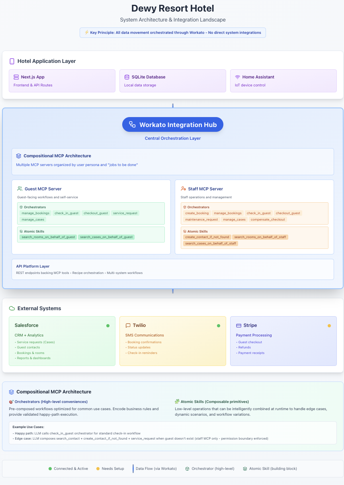

# Dewy Resort Hotel - Sample Application

**Enterprise MCP Design Patterns for LLM Productivity**

A demonstration of how to design Model Context Protocol (MCP) servers that maximize AI agent productivity while maintaining backend system integrity, performance, security, and scale.

---

## What This Demonstrates

This sample application showcases **enterprise-grade MCP architecture patterns** that solve real-world challenges when integrating LLMs with backend systems:

### The Problem
Most MCP implementations give AI agents direct database access or expose raw APIs, leading to:
- ❌ **Poor performance** - Agents make 10+ API calls for simple tasks
- ❌ **Data integrity issues** - Agents create invalid state transitions
- ❌ **Security vulnerabilities** - Overly permissive tool access
- ❌ **Scalability bottlenecks** - No caching, retries, or rate limiting
- ❌ **Poor user experience** - Slow responses, frequent failures

### The Solution: Compositional MCP Architecture

This project demonstrates a **two-tier tool design** that balances LLM flexibility with enterprise requirements:

**🎯 Orchestrators (High-level tools)** - Optimized for common scenarios
- Encode business rules and prerequisites
- Execute multi-step workflows in < 3 seconds
- Handle state transitions in correct dependency order
- Provide great UX for 80% of use cases

**🧩 Atomic Skills (Building blocks)** - For edge cases and flexibility
- Single-responsibility operations
- Composable by AI agents at runtime
- Enable handling of unexpected scenarios
- Maintain proper authorization boundaries

**Key Result:** AI agents get fast, validated workflows for common tasks AND the flexibility to handle edge cases intelligently.

---

## Why This Matters

<br/>
*Enterprise MCP Architecture - Persona-based servers with orchestrators and atomic skills*

### Real-World Example: Guest Check-In

<br/>
*Check-in orchestrator: < 3 seconds, 6 API calls, validates prerequisites, ensures correct state transitions*

**Traditional Approach (LLM with raw Salesforce access):**
```
Agent makes 15+ separate API calls:
1. Search for guest → 400ms
2. Validate guest exists → 200ms
3. Search for booking → 400ms
4. Check booking status → 200ms
5. Validate room number → 200ms
6. Search for room → 400ms
7. Check room status → 200ms
8. Update booking status → 300ms
9. Update room status → 300ms
10. Update opportunity → 300ms
... error handling, retries ...

Total time: 8-12 seconds
Failure rate: 15-20% (race conditions, validation errors)
```

**Enterprise MCP Approach (Orchestrator):**
```
Agent calls one orchestrator:
POST /check-in-guest {guest_email, check_in_date}

Orchestrator internally:
- Validates prerequisites in parallel (3 reads)
- Executes state transitions in order (3 updates)
- Handles errors gracefully
- Ensures data integrity

Total time: < 3 seconds
Failure rate: < 2% (only fails on legitimate business rule violations)
```

**Result:** 3-4x faster, 90% fewer errors, better user experience.

### Edge Case Handling with Atomic Skills

**Scenario:** Guest says "I need towels in room 101" but contact doesn't exist in system

**Orchestrator-only approach:**
- ❌ Fails with "Contact not found" error
- ❌ Agent can't proceed
- ❌ Poor user experience

**Compositional approach (Orchestrator + Atomic Skills):**
- ✅ Agent detects missing contact
- ✅ Agent composes: `create_contact` → `upsert_case`
- ✅ Handles edge case with proper approval authority
- ✅ Great user experience

**Key Insight:** Give agents *both* optimized workflows AND building blocks for flexibility.

---

## Architecture Principles

### 1. Zero Direct System Integrations

**All data movement flows through Workato integration hub**

```
❌ DON'T: Hotel App → Salesforce (tight coupling)
❌ DON'T: Hotel App → Stripe (security risk)
❌ DON'T: LLM → Salesforce (no validation)

✅ DO: Hotel App → Workato → Salesforce (orchestrated)
✅ DO: LLM Agent → MCP Server → Workato → Backends (validated, secure)
```

**Benefits:**
- **Performance**: Workato handles caching, connection pooling, retries
- **Security**: Single integration layer with centralized auth
- **Maintainability**: Backend changes don't break frontend
- **Observability**: All integration traffic in one place

### 2. Persona-Based MCP Servers

**Organize tools by user role and "jobs to be done"**

```
Guest MCP Server:
├── Orchestrators: check_in_guest, checkout_guest, service_request
└── Atomic Skills: search_contact, search_booking, upsert_case

Staff MCP Server:
├── Orchestrators: maintenance_request, assign_room, update_case_status
└── Atomic Skills: create_contact, search_room, update_room_status
```

**Benefits:**
- **Security**: Users only access tools appropriate for their role
- **Performance**: Smaller tool context = better LLM reasoning
- **Usability**: Relevant tools for each persona
- **Scale**: Independent servers can be optimized separately

### 3. Idempotency and State Validation

**Every orchestrator validates prerequisites and checks for duplicate operations**

Example: Check-in orchestrator validates:
- ✅ Guest exists (Contact.id)
- ✅ Reservation exists (Booking.status = Reserved)
- ✅ Room is available (Hotel_Room.status = Vacant)
- ✅ No existing check-in for this booking (idempotency)

**Benefits:**
- **Data integrity**: No invalid state transitions
- **Reliability**: Retry-safe operations
- **Error handling**: Clear, actionable error messages
- **Audit trail**: All validation logged

### 4. Performance Optimization

**Orchestrators minimize API calls and latency**

Techniques demonstrated:
- **Parallel execution**: Read operations execute concurrently
- **Dependency ordering**: Updates execute in correct sequence
- **Batch operations**: Multiple updates in single transaction where possible
- **Caching**: Workato caches connection pools and reference data
- **Circuit breakers**: Fail fast on downstream outages

**Result:** Typical orchestrators complete in < 3 seconds with 4-6 API calls.

---

## What's Included

### MCP Server Implementation (Workato)

**33 Recipes organized as MCP tools:**

**12 Orchestrators** (High-level workflows):
- `check_in_guest` - Multi-object state transition (< 3s, 6 API calls)
- `checkout_guest` - Payment processing + room release
- `service_request` - Guest service case creation
- `maintenance_request` - Staff maintenance workflow
- `create_booking_orchestrator` - Full booking with availability check
- Additional orchestrators for case management, search workflows

**21 Atomic Skills** (Building blocks):
- **Salesforce (15)**: search_contact, search_booking, search_room, create_contact, update_booking_status, upsert_case, etc.
- **Stripe (6)**: create_customer, create_payment_intent, confirm_payment, retrieve_status, create_refund

### Hotel Management Application (Next.js)

- **Guest Portal**: Service requests, room controls, billing, AI assistant
- **Manager Portal**: Dashboard, maintenance management, room operations
- **MCP Integration**: Demonstrates how to call enterprise MCP servers from application code
- **Local Database**: SQLite for app-specific data (sessions, UI state)

### Backend Systems

- **Salesforce**: System of record (Bookings, Rooms, Cases, Contacts, Opportunities)
- **Stripe**: Payment processing (optional)
- **Twilio**: SMS notifications (optional)

---

## Quick Start

**Prerequisites:**
- Node.js 20+, Python 3.8+
- [Workato Developer sandbox](https://www.workato.com/sandbox) (free Developer sandbox)
- [Salesforce Developer org](https://developer.salesforce.com/signup) (free Developer Edition)
- [Stripe Developer account](https://dashboard.stripe.com/register) (Stripe Developer sign up)

### 1. Clone and Install

```bash
git clone <repo-url>
cd dewy-resort
npm install
```

### 2. Deploy Salesforce Metadata ⭐

Salesforce is the system of record - deploy it first.

```bash
# Install CLI
make setup tool=salesforce

# Authenticate
bin/sf org login web --alias myDevOrg

# Deploy metadata and seed data
make sf-deploy org=myDevOrg
```

**📚 See:** [docs/SALESFORCE_SETUP.md](./docs/SALESFORCE_SETUP.md)

### 3. Deploy Workato MCP Server ⭐

Workato implements the enterprise MCP architecture.

```bash
# Install CLI
make setup tool=workato

# Add API token to .env (see guide for how to generate token)
WORKATO_API_TOKEN=your_token
WORKATO_API_EMAIL=your_email

# Deploy all recipes
make workato-init

# Configure connections in Workato UI (see guide)

# Start recipes
make start-recipes
```

**⚠️ IMPORTANT:** 4 recipes require manual activation in Workato UI (SOQL query configuration). See detailed guide.

**📚 See:** [docs/WORKATO_SETUP.md](./docs/WORKATO_SETUP.md)

### 4. Configure Dewy Hotel Application

Now configure the hotel app to call your deployed Workato recipes:

```bash
# Copy env template
cp .env.example .env
```

**Add Workato API Collection endpoint to `.env`:**

```bash
# Salesforce API Collection URL (get from Workato UI)
# In Workato: Navigate to any recipe → API Collection tab → Copy base URL
SALESFORCE_API_COLLECTION_URL=https://apim.workato.com/your-collection-id

# Use same token as deployment
SALESFORCE_API_AUTH_TOKEN=your_token_from_step_3
```

**Initialize local database** (for hotel app sessions, UI state):

```bash
npm run db:init
npm run db:seed
```

**Note:** The local SQLite database stores hotel app-specific data (user sessions, device states). Backend data (bookings, rooms, cases) lives in Salesforce and is accessed via Workato recipes exposed as REST API endpoints.

**About MCP:** The Workato recipes implement the orchestrator and atomic skill patterns that would be exposed as MCP tools. The hotel app currently calls these recipes directly via REST API. For AI agent integration, these same recipes would be exposed via  MCP server, so the recipes appear as tools to LLMs. This is what the hands-on workshop walks through in the initial unit. MCP servers are configured declaratively in Workato. 

### 5. Start Application

```bash
npm run dev
```

Open [http://localhost:3000](http://localhost:3000)

**Test logins (mock mode):**
- Guest: guest@example.com / password
- Manager: manager@example.com / password

---

## Learning Path

### For Workshop Participants

**Goal:** Understand enterprise MCP design patterns

1. **Start here:** Review architecture diagrams in [`docs/architecture/`](./docs/architecture/)
2. **Explore:** Compare orchestrator vs atomic skill patterns
3. **Observe:** Check-in orchestrator flow (prerequisites, state transitions, error handling)
4. **Experiment:** Try edge cases (missing contact, double check-in, invalid room)
5. **Reflect:** Why are orchestrators faster? Why do atomic skills matter?

### For Developers Building MCP Servers

**Goal:** Apply these patterns to your own projects

1. **Architecture:** Study [system-architecture.png](./docs/architecture/system-architecture.png)
2. **Implementation:** Review Workato recipes in `workato/` directory
3. **Patterns:** Read [WORKATO_SETUP.md](./docs/WORKATO_SETUP.md) for detailed pattern explanations
4. **Adaptation:** Consider how to apply orchestrator + atomic skill pattern to your domain

### Key Takeaways

✅ **Orchestrators for common scenarios** - Fast, validated, great UX </br>
✅ **Atomic skills for flexibility** - Handle edge cases intelligently </br>
✅ **Zero direct integrations** - All through central hub </br>
✅ **Persona-based servers** - Security, performance, usability </br>
✅ **Idempotency and validation** - Data integrity, reliability </br>
✅ **Performance optimization** - Parallel reads, dependency ordering </br>

---

## Additional Resources

### Setup Guides
- **[Salesforce Setup](./docs/SALESFORCE_SETUP.md)** - Deploy custom objects and seed data
- **[Workato Setup](./docs/WORKATO_SETUP.md)** - Deploy MCP server recipes
- **[Architecture Diagrams](./docs/architecture/README.md)** - Visual documentation of all workflows

### Optional Features
- **[Stripe Integration](./docs/WORKATO_SETUP.md#stripe-recipe-activation-optional)** - Payment processing
- **[Cognito Authentication](#cognito-authentication-workshop-convenience)** - User auth (workshop convenience)
- **[Bedrock AI Chat](#bedrock-ai-chat-optional)** - AI assistants (optional)
- **[Home Assistant Integration](./app/docs/HOME_ASSISTANT_QUICKSTART.md)** - IoT room controls

### Technical Details
- **[Salesforce Metadata](./salesforce/README.md)** - Complete object and field documentation
- **[Project Structure](#project-structure)** - Codebase organization
- **[CLI Commands](#cli-commands)** - Automation scripts

---

## Project Structure

```
dewy-resort/
├── workato/                      # ⭐ MCP SERVER IMPLEMENTATION
│   ├── atomic-salesforce-recipes/   # 15 atomic skills
│   ├── atomic-stripe-recipes/       # 6 payment atomic skills
│   ├── orchestrator-recipes/        # 12 high-level orchestrators
│   ├── Salesforce/                  # API Collection definitions
│   └── Workspace-Connections/       # Connection configs
├── docs/
│   ├── architecture/             # ⭐ ARCHITECTURE DIAGRAMS
│   │   ├── system-architecture.png
│   │   ├── guest-checkin-flow.png
│   │   ├── guest-checkout-flow.png
│   │   ├── guest-service-request-flow.png
│   │   └── maintenance-request-flow.png
│   ├── SALESFORCE_SETUP.md       # Salesforce deployment guide
│   ├── WORKATO_SETUP.md          # MCP server setup guide
│   └── ...
├── app/                          # Next.js application
│   ├── guest/                    # Guest portal
│   ├── manager/                  # Manager portal
│   └── api/                      # API routes (calls MCP server)
├── salesforce/                   # Salesforce metadata
│   ├── force-app/                # Custom objects, fields, app
│   └── data/                     # Seed data
└── components/                   # React components
```

---

## CLI Commands

```bash
# Setup
make setup                        # Install all CLIs
make setup tool=workato          # Install Workato CLI only
make setup tool=salesforce       # Install Salesforce CLI only

# Workato (MCP Server)
make workato-init                # Deploy all recipes
make start-recipes               # Start recipes (automated)

# Salesforce (Backend)
make sf-deploy org=<alias>       # Deploy metadata and seed data

# Status
make status                      # Check all CLIs
```

---

## Mock Mode (Development Only)

For frontend development without backend setup:

```bash
# In .env
WORKATO_MOCK_MODE=true

# Restart server
npm run dev
```

**⚠️ Note:** Mock mode simulates MCP responses. Use for frontend work only, not for learning MCP architecture patterns.

---

## Optional Features

### Cognito Authentication (Workshop Convenience)

For workshops where participants don't have their own auth:

```bash
AUTH_PROVIDER=cognito
# Deploy Cognito User Pool
cd aws/cloudformation
./deploy.sh dev http://localhost:3000/api/auth/cognito/callback http://localhost:3000 dewy-hotel
```

### Bedrock AI Chat (Optional)

AI-powered chat assistants (demonstrates LLM + MCP integration):

```bash
# Deploy Identity Pool
cd aws/cloudformation
./deploy-identity-pool.sh dev <user-pool-id> <client-id>

# Configure in .env
COGNITO_IDENTITY_POOL_ID=your_pool_id
```

---

## Technology Stack

- **MCP Server**: Workato (33 recipes organized as orchestrators and atomic skills)
- **Backend Systems**: Salesforce (CRM), Stripe (payments), Twilio (SMS)
- **Application**: Next.js 14, React, TypeScript, Tailwind CSS
- **Database**: SQLite (local app data only)
- **Auth**: Amazon Cognito (optional) or mock mode
- **AI**: Amazon Bedrock (optional chat assistants)

---

## Why Workato?

This sample uses **Workato** as the MCP server implementation, but the architectural patterns apply to any integration platform:

✅ **Visual recipe builder** - Easy to understand workflows </br>
✅ **Built-in connectors** - Salesforce, Stripe, Twilio out of the box </br>
✅ **API Collections** - Native REST API exposure </br>
✅ **Enterprise features** - Error handling, retries, logging, monitoring </br>
✅ **Workshop-friendly** - Visual representation aids learning</br>

**The patterns work with:** Custom APIs, serverless functions, other orchestration systems, etc.

---

## License

MIT

---

## Questions?

This is a **sample application for teaching enterprise MCP design patterns**. The goal is to demonstrate how to build MCP servers that maximize LLM productivity while maintaining backend integrity, performance, security, and scale.

**Focus areas:**
- Why orchestrators matter for performance and UX
- When to use atomic skills vs orchestrators
- How to design persona-based MCP servers
- Patterns for idempotency and state validation
- Zero direct system integrations architecture

For implementation details, see the guides in [`docs/`](./docs/).
