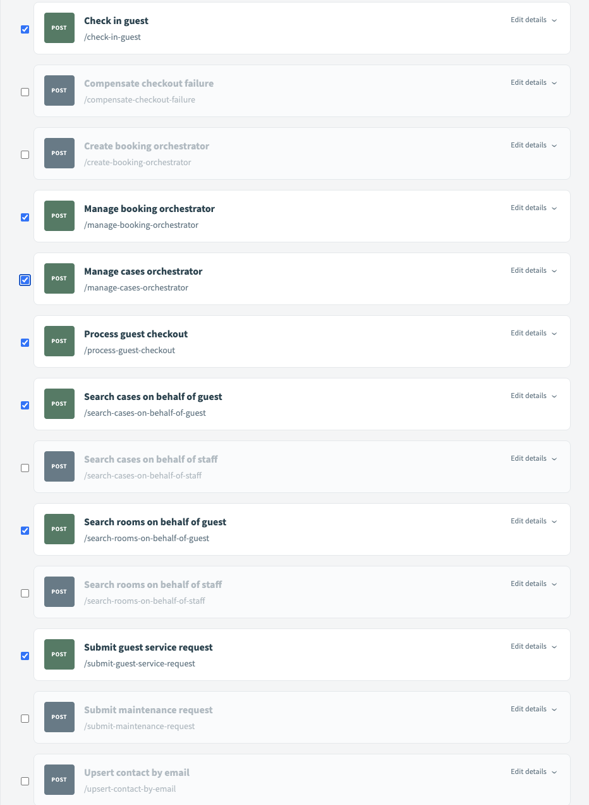
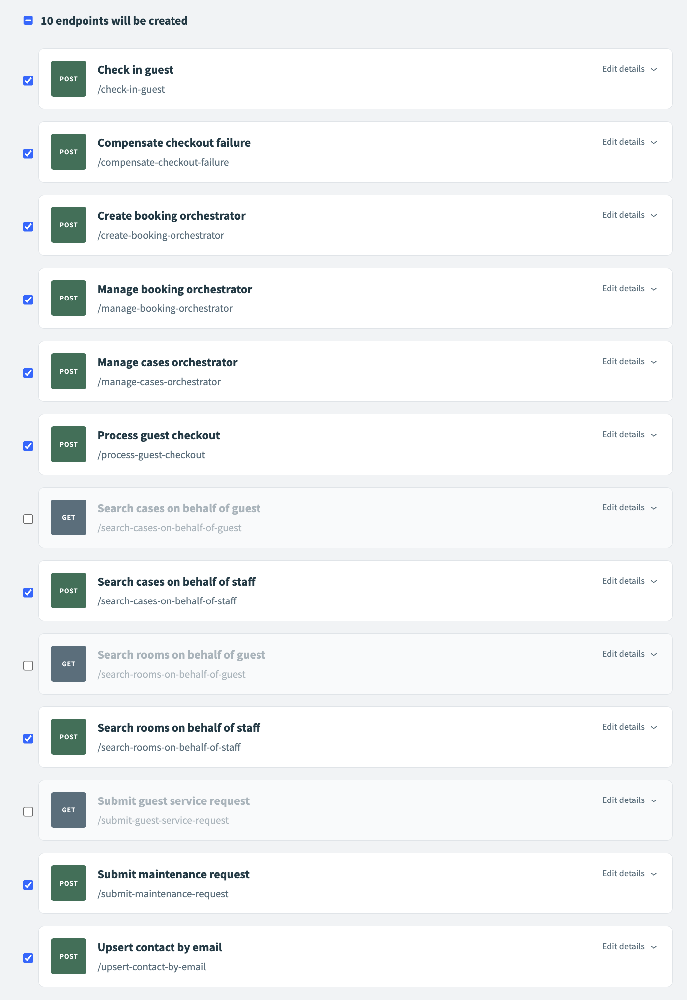

# Unit 1: Configuring MCP Servers

**Hands-On Configuration (45 minutes)**

---

## Learning Objectives

- Create API Collections from orchestrator recipes
- Configure API endpoints with proper methods and descriptions
- Create persona-based MCP servers (Guest and Manager)
- Understand how tool descriptions enable LLM interactions

---

## Overview: Two Server Personas

The Dewy Resort application uses two MCP servers, each tailored to a specific user persona:

| Server | Persona | Purpose |
|--------|---------|---------|
| **Guest Server** | Hotel guests | Self-service operations: check-in, checkout, booking management, service requests |
| **Manager Server** | Hotel staff | Operations management: all guest capabilities plus maintenance, case management, compensation workflows |

Managers have greater authorization and access to business processes than guests. For example, only managers can process refunds via `compensate_checkout_failure` or file maintenance requests.

> **Note:** Due to MCP platform requirements, each MCP server requires its own dedicated API Collection. You'll create two collections—one for each persona—then create the corresponding MCP servers.

---

## Step 0: Understand the Recipe Organization (5 min)

Before creating API Collections, take a moment to understand how the recipes are organized in your cloned repository:

```
workato/
├── atomic-salesforce-recipes/   # Single-purpose Salesforce operations
│   ├── search_contact_by_email.recipe.json
│   ├── search_room_by_number.recipe.json
│   ├── upsert_case.recipe.json
│   └── ...
├── atomic-stripe-recipes/       # Single-purpose payment operations
│   ├── create_stripe_payment_intent.recipe.json
│   └── ...
└── orchestrator-recipes/        # Composed workflows (what we'll expose as tools)
    ├── check_in_guest.recipe.json
    ├── process_guest_checkout.recipe.json
    └── ...
```

**Key concept:**
- **Atomic recipes** perform a single operation (one API call, no business logic)
- **Orchestrator recipes** compose multiple atomic recipes into complete workflows

When creating API Collections, you'll select from the **orchestrator-recipes** folder — these are the complete workflows suitable for exposing as MCP tools.

---

## Step 1: Create the Guest API Collection (10 min)

### 1.1 Navigate to API Platform

1. In Workato, navigate to **Platform → API Platform → API Collections**
2. Click **Create Collection**

### 1.2 Select Guest Recipes

1. When prompted to choose a collection type, select **Recipe folder**
2. Select the **orchestrator-recipes** folder
3. **Important:** First, **uncheck all endpoints** (they may be pre-selected)
4. **Select only the following 7 recipes** for the guest collection (listed in alphabetical order as they appear):

| Recipe | Purpose |
|--------|---------|
| `check_in_guest` | Self-service check-in |
| `create_booking_orchestrator` | Make new reservations |
| `manage_booking_orchestrator` | Modify existing bookings |
| `process_guest_checkout` | Self-service checkout with payment |
| `search_cases_on_behalf_of_guest` | Track their service requests |
| `search_rooms_on_behalf_of_guest` | View their room information |
| `submit_guest_service_request` | Request housekeeping, amenities |



### 1.3 Configure Guest Endpoints

For each endpoint on the screen:

1. Set the **Method** to **POST**
2. Copy/paste the corresponding description from below into the **Description** field

---

**Endpoint: `check_in_guest`**

```
Orchestrate hotel check-in: validates guest/reservation prerequisites, checks room vacancy, executes state transitions (Booking→Checked In, Room→Occupied, Opportunity→Checked In). Requires guest_email; optional check_in_date (default: today), booking_number, payment_id (default: PENDING_CHECKIN). Returns booking/room details or error codes (404: guest/reservation not found, 409: multiple reservations or room not vacant).
```

---

**Endpoint: `create_booking_orchestrator`**

```
Create new hotel booking: upserts guest contact, validates room availability for date range, creates Opportunity and Booking__c records, marks room Reserved. Requires guest_email, guest_first_name, guest_last_name, room_number, check_in_date, check_out_date; optional guest_phone, number_of_guests (default: 1), special_requests, booking_external_id. Returns booking confirmation or error codes (400: room not found, 409: room not available for dates).
```

---

**Endpoint: `manage_booking_orchestrator`**

```
Update existing booking by external_id. Resolves guest_email→contact_id and room_number→room_id automatically. Requires external_id; optional guest_email, room_number, check_in_date, check_out_date, number_of_guests, special_requests. Returns updated booking details or error codes (400: booking/guest/room not found).
```

---

**Endpoint: `process_guest_checkout`**

```
Orchestrate hotel checkout with Stripe payment: validates guest/booking, processes payment, executes state transitions (Booking→Checked Out, Room→Dirty, Opportunity→Closed Won). Requires guest_email, guest_name, amount (cents), payment_method_id, idempotency_token; optional room_number, booking_number. Returns payment confirmation or error codes (402: payment failed, 404: guest/booking not found, 202: 3D Secure required with next_action_url).
```

---

**Endpoint: `search_cases_on_behalf_of_guest`**

```
Search service cases filed by a specific guest. Requires guest_email; optional status_filter (Open/Closed/All, default: Open), case_type_filter (Facilities/Service Request/Housekeeping), limit (default: 10). Returns array of cases with case_number, type, status, priority, subject, description, room info, plus count.
```

---

**Endpoint: `search_rooms_on_behalf_of_guest`**

```
Search rooms associated with a guest's bookings. Requires guest_email; optional filter (current/historical/all, default: current), limit (default: 10). Returns array of rooms with room_number, status, room_type, floor, nightly_rate, max_occupancy, plus count and filter_applied.
```

---

**Endpoint: `submit_guest_service_request`**

```
Create Salesforce Case for guest service request (housekeeping, amenities). Validates guest contact exists with type=Guest, links case to guest and room. Requires idempotency_token, guest_email, guest_first_name, guest_last_name, room_number, type, priority, description. Returns case_id/case_number or error codes (400: guest not found, invalid contact type, or room not found).
```

---

### 1.4 Name and Save the Guest Collection

1. Click **Next**
2. Enter the collection details:
   - **Name:** `dewy-resort-guest`
   - **Version:** `1.0`
   - **Description:** `Self-service API endpoints for hotel guests to manage check-in, checkout, bookings, and service requests.`
3. Click **Save**

**CHECKPOINT:** Guest API Collection created with 7 endpoints

---

## Step 2: Create the Manager API Collection (10 min)

### 2.1 Create Another Collection

1. Return to **API Collections**
2. Click **Create Collection**

### 2.2 Select Manager Recipes

1. Select **Recipe folder**
2. Select the **orchestrator-recipes** folder
3. **Important:** First, **uncheck all endpoints** (they may be pre-selected)
4. **Select only the following 10 recipes** for the manager collection (listed in alphabetical order as they appear):

| Recipe | Purpose |
|--------|---------|
| `check_in_guest` | Check in guests |
| `compensate_checkout_failure` | Process refunds for failed checkouts |
| `create_booking_orchestrator` | Create bookings for guests |
| `manage_booking_orchestrator` | Modify any booking |
| `manage_cases_orchestrator` | Create/update any case |
| `process_guest_checkout` | Process guest checkouts |
| `search_cases_on_behalf_of_staff` | View all cases across the hotel |
| `search_rooms_on_behalf_of_staff` | View all rooms with guest details |
| `submit_maintenance_request` | Report maintenance/facilities issues |
| `upsert_contact_by_email` | Manage guest/staff contacts |



### 2.3 Configure Manager Endpoints

For each endpoint, set **Method** to **POST** and paste the corresponding description:

---

**Endpoint: `check_in_guest`**

```
Orchestrate hotel check-in: validates guest/reservation prerequisites, checks room vacancy, executes state transitions (Booking→Checked In, Room→Occupied, Opportunity→Checked In). Requires guest_email; optional check_in_date (default: today), booking_number, payment_id (default: PENDING_CHECKIN). Returns booking/room details or error codes (404: guest/reservation not found, 409: multiple reservations or room not vacant).
```

---

**Endpoint: `compensate_checkout_failure`**

```
Saga compensation for failed checkout: refunds Stripe payment and reverts Salesforce state (Booking→Checked In, Room→Occupied, Opportunity→Checked In). Requires payment_intent_id, guest_email, idempotency_token; optional reason (for audit). Returns refund_id/refund_amount/refund_status or error codes (404: payment not found, 422: payment not refundable).
```

---

**Endpoint: `create_booking_orchestrator`**

```
Create new hotel booking: upserts guest contact, validates room availability for date range, creates Opportunity and Booking__c records, marks room Reserved. Requires guest_email, guest_first_name, guest_last_name, room_number, check_in_date, check_out_date; optional guest_phone, number_of_guests (default: 1), special_requests, booking_external_id. Returns booking confirmation or error codes (400: room not found, 409: room not available for dates).
```

---

**Endpoint: `manage_booking_orchestrator`**

```
Update existing booking by external_id. Resolves guest_email→contact_id and room_number→room_id automatically. Requires external_id; optional guest_email, room_number, check_in_date, check_out_date, number_of_guests, special_requests. Returns updated booking details or error codes (400: booking/guest/room not found).
```

---

**Endpoint: `manage_cases_orchestrator`**

```
Create or update Salesforce Case by idempotency_token. Resolves guest_email→contact_id and room_number→room_id automatically. Requires idempotency_token; optional guest_email, room_number, type, priority, status, subject, description, origin (Web/Phone/Email/Internal). Returns case_id/case_number or error codes (400: guest/room not found).
```

---

**Endpoint: `process_guest_checkout`**

```
Orchestrate hotel checkout with Stripe payment: validates guest/booking, processes payment, executes state transitions (Booking→Checked Out, Room→Dirty, Opportunity→Closed Won). Requires guest_email, guest_name, amount (cents), payment_method_id, idempotency_token; optional room_number, booking_number. Returns payment confirmation or error codes (402: payment failed, 404: guest/booking not found, 202: 3D Secure required with next_action_url).
```

---

**Endpoint: `search_cases_on_behalf_of_staff`**

```
Search all service cases with staff-level access. Optional guest_email, status_filter (New/In Progress/Closed), priority_filter (Low/Medium/High/Urgent), case_type_filter (Maintenance/Facilities/Service Request/Housekeeping), room_number, limit (default: 50). Returns array of cases with full details including guest contact info.
```

---

**Endpoint: `search_rooms_on_behalf_of_staff`**

```
Search all hotel rooms with staff-level access. Optional status_filter (Vacant/Occupied/Dirty/Maintenance), floor_filter (1-10), limit (default: 20). Returns array of rooms with full details including current guest name/email/phone, plus count.
```

---

**Endpoint: `submit_maintenance_request`**

```
Create Salesforce Case for staff-reported maintenance/facilities issues. Validates contact exists with type=Manager, links case to room. Requires idempotency_token, manager_email, manager_first_name, manager_last_name, room_number, type (Maintenance/Facilities), priority, description. Returns case_id/case_number or error codes (400: manager not found, invalid contact type, or room not found).
```

---

**Endpoint: `upsert_contact_by_email`**

```
Find or create Salesforce Contact by email. Requires email, first_name, last_name, contact_type (Guest/Manager/Vendor); optional phone, account_id (uses default if omitted). Returns contact_id, found (boolean), created (boolean). HTTP 200 if existing contact found, 201 if new contact created.
```

---

### 2.4 Name and Save the Manager Collection

1. Click **Next**
2. Enter the collection details:
   - **Name:** `dewy-resort-manager`
   - **Version:** `1.0`
   - **Description:** `Operations API endpoints for hotel managers including guest services, maintenance, case management, and compensation workflows.`
3. Click **Save**

**CHECKPOINT:** Manager API Collection created with 10 endpoints

---

## Step 3: Activate All Endpoints (2 min)

Run the following command to activate all endpoints in both collections:

```bash
make enable-api-endpoints
```

This script activates each endpoint so they're ready to be used by MCP servers.

**CHECKPOINT:** All endpoints activated in both collections

---

## Step 4: Create the Guest MCP Server (5 min)

### 4.1 Navigate to MCP Servers

1. In **AI Hub**, click **MCP Servers** in the menu
2. Click **Create MCP Server**

### 4.2 Configure the Guest Server

1. **Name:** `dewy-resort-guest`
2. **API Collection:** Select `dewy-resort-guest`
3. **Description:** Copy and paste the following:

```
MCP server for hotel guests to manage their stay at Dewy Resort. Provides self-service tools for check-in, checkout, booking management, and service requests. Guests can view their own room and case information but cannot access other guests' data or staff-only operations.
```

4. Click **Create**

**CHECKPOINT:** Guest MCP server created

---

## Step 5: Create the Manager MCP Server (5 min)

### 5.1 Create the Server

1. Click **Create MCP Server**
2. Configure:
   - **Name:** `dewy-resort-manager`
   - **API Collection:** Select `dewy-resort-manager`
   - **Description:** Copy and paste the following:

```
MCP server for hotel managers to manage operations at Dewy Resort. Provides tools for guest check-in/checkout, booking management, maintenance requests, case management, and compensation workflows. Managers have elevated access to view all rooms, all cases, and process refunds.
```

3. Click **Create**

**CHECKPOINT:** Manager MCP server created

---

## Step 6: Configure and Test the MCP Servers (10 min)

### 6.1 Get Connection Details from Workato

For each MCP server, you need to copy the URL and token:

**Get the Server URL:**
1. Click on the MCP server name
2. Copy the **Server URL**

**Get the Token:**
1. Go to the MCP server's **Settings** tab
2. Find **Developer MCP Token**
3. Copy **only the token value** (not the full header)

### 6.2 Configure Your Local Environment

Open your project's `app/.env` file and add the following variables:

```bash
# Guest MCP Server
MCP_GUEST_URL=<paste guest server URL here>
MCP_GUEST_TOKEN=<paste guest server token here>

# Manager MCP Server
MCP_MANAGER_URL=<paste manager server URL here>
MCP_MANAGER_TOKEN=<paste manager server token here>
```

### 6.3 Unit 1 Checklist

- [ ] Guest API Collection created with 7 endpoints, all set to POST
- [ ] Manager API Collection created with 10 endpoints, all set to POST
- [ ] All endpoints activated via `make enable-api-endpoints`
- [ ] Guest MCP server created and linked to guest collection
- [ ] Manager MCP server created and linked to manager collection
- [ ] `.env` file configured with MCP server URLs and tokens

**CHECKPOINT:** MCP servers created and configured. Testing happens in Unit 2.

---

## What You Built

**Two API Collections:**
- `dewy-resort-guest` v1.0 — 7 endpoints for guest self-service
- `dewy-resort-manager` v1.0 — 10 endpoints for staff operations

**Two MCP Servers:**

| Server | API Collection | Key Capabilities |
|--------|----------------|------------------|
| **Guest** | `dewy-resort-guest` | Self-service check-in/out, booking, service requests |
| **Manager** | `dewy-resort-manager` | Full operations including maintenance, case management, refunds |

The tool descriptions you added help the LLM understand:
- **What** each tool does
- **When** to use it
- **What inputs** are required vs optional
- **What outputs** to expect (including error codes)

This is the power of well-designed MCP tool descriptions—they enable natural language interaction with complex backend workflows.

---

## Troubleshooting

| Issue | Solution |
|-------|----------|
| Endpoint not appearing in MCP server | Verify endpoint is in an active API collection; check recipe is running |
| Can't find recipes in folder | Use the search box to filter by recipe name |
| Authentication errors | Regenerate API key; verify copied correctly (no extra spaces) |
| `make enable-api-endpoints` fails | Check WORKATO_API_TOKEN in .env is valid |
